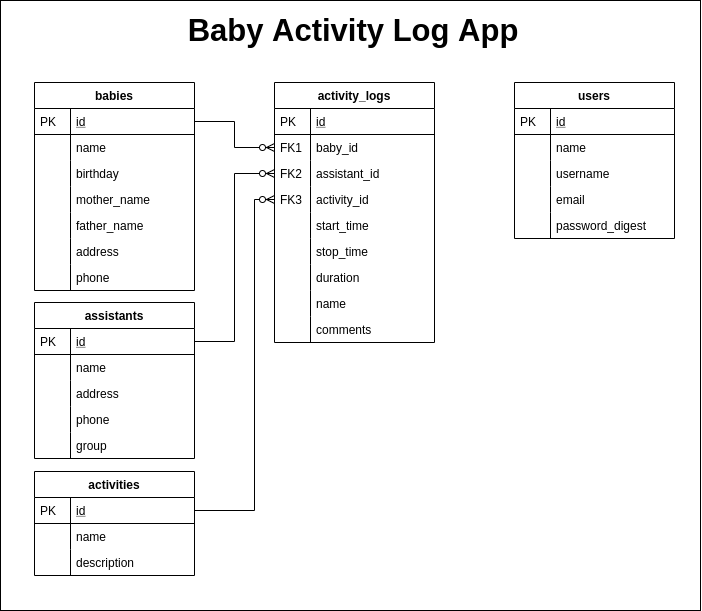

<h1 align="center">[Rails] Kinedu Technical Test / Rails API and Web App </h1>
<p>
  
  <a href="#" target="_blank">
    
  </a>
  <a href="https://twitter.com/ae_cordova" target="_blank">
    
  </a>
</p>

___
## Description of the project

This is a sample application to demonstrate technical proficiency on Rails. Some daycare center needs to keep track of the activities performed by babies. So, they plan to request the development of a web app that could enable the education assitants to record such ativities.

Requirements:

Part 1: Create API endpoints to create activity log records according to the provided ERD.

| API EndPoints:  |   |
|---|---|
| GET api/activities  | List of activities  |
| GET api/babies  | List of babies  |
| GET api/babies/:id/activity_logs  | List of aassigned activities  for each baby |
| POST api/activity_logs  | Start/Create a new Activity record  |
| PUT api/activity_logs/:id  | Modify/End an activity, allowing for comment addition  |
| Restrictions: |  |
| Responses should be in JSON. Activities cant be ended prior to the time they have been started |
| Activities cant be ended prior to the time they have been started |
| DatesTime fields should be handled in UTC and iso8601 format |
| Dates should be returned in  YYYY-MM-DD format |
| Endpoins should use the corresponding CRUD action according to what they perform |
| Endpoins should respond with the corresponding HTTP status |
| They should consider errors for entering the wrong dates with descriptive error messages |

Part 2: Create a web app to review the log of activities of the babies in the daycare. 

| Web App:  |   |
|---|---|
| Path:  |  /activity_logs  |
| Order of logs:  | Newest to oldest descending  |
| Duration:  | Show duration in minutes, once the activity has finished |
| Filters:  | For filtering options, the user can choose the either/both baby's and/or the assitant's names and/ot the activity status   |
| Restrictions: |  |
| Login pages and access levels are not required |
| DateTimes should be shown in local time |
| Use bootstrap with default formatting, It doesnt require an complex design |

| Extras:  |   |
|---|---|
| Any additional functionality will be considered extra, completely optional, Please enumerate extras.   |


<h3 align="center">Data Model Representation</h3>
<p align="center">
  
</p>


### ⭐️ Built with
* Ruby on Rails 6
* HTML5/CSS3/Sass
* Javascript
* MariaDB

### Dev Environment Requirements:
* Ruby needs to be installed to run the code, check [here](https://www.ruby-lang.org/en/documentation/installation/) for further steps


### ⭐️ Running the code

#### Live Version:

You can find a live running version of this app on the following link: [Activity Logs](https://kinedu-test.herokuapp.com//)

#### Instructions for running on local environment:

1. Clone the repo

2. Navigate to the root directory

***  Important: *** <br> 
This app uses Maria DB, you should have it installed on your computer for it to work correctly. Otherwhise, open the Gemfile and change the mysql2 gem for any other db gem  ***
 <br>

3. Run bundle install to ensure all the needed gems are installed:

    ```
    $ bundle install
    ```
3. Run Yarn Install
    ```
    $ yarn install --check-files
    ```
3. Migrate the DB
    ```
    $ rails db:migrate
    ```
3. Run Rails Server
    ```
    $ rails server
    ```
3. Open localhost:3000 on a browser to get to the home page
    ```
    https://localhost:3000
    ```
### ⭐️ How it works

1. Go to the Home Page and click on the  Sign Up Link

2. Fill up your information. Name, email, password and confirmation are required.

3. The app will automatically sing you in. (If you already have signed up previously, Click on the Login link on the form, and fill up your email and password.)

4. Once you're logged you will be redirected to the activity logs webpage. 
   
   * On the Filters section, choose or type any value on the table, then click the filter button.

      The database will show the values according to the values in the text input.

   * Activity logs will display duration in minutes, once their stop time has been updated.
   
   * Newest logs will appear first

<!-- CONTRIBUTING -->
## Contributing

Any contributions you make are **greatly appreciated**.

1. Fork the Project
2. Create your Feature Branch (`git checkout -b feature/AmazingFeature`)
3. Commit your Changes (`git commit -m 'Add some AmazingFeature'`)
4. Push to the Branch (`git push origin feature/AmazingFeature`)
5. Open a Pull Request


## Authors

👤 **Angel Cordova** 
* Github: [@aecordova](https://github.com/https:\/\/github.com\/aecordova)  

